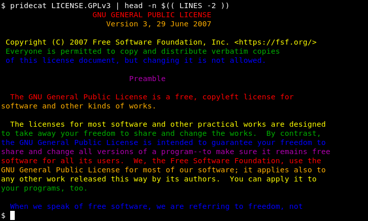

<!-- {{{1 -->

    File        : README.md
    Maintainer  : Felix C. Stegerman <flx@obfusk.net>
    Date        : 2020-06-20

    Copyright   : Copyright (C) 2020  Felix C. Stegerman
    Version     : v0.0.1
    License     : GPLv3+

<!-- }}}1 -->

[](https://www.gnu.org/licenses/gpl-3.0.html)

## Description

TODO

## Examples



## Help

```bash
$ pridecat --help
```

## Requirements

Python >= 3.5 + click.

## Installing

Install the dependencies, as e.g. debian packages or using `pip`:

```bash
$ apt install python3-click       # debian/ubuntu
$ pip install click               # pip
```

Then just put `pridecat` somewhere on your `$PATH` (e.g. `~/bin`).

## License

[](https://www.gnu.org/licenses/gpl-3.0.html)

<!-- vim: set tw=70 sw=2 sts=2 et fdm=marker : -->
